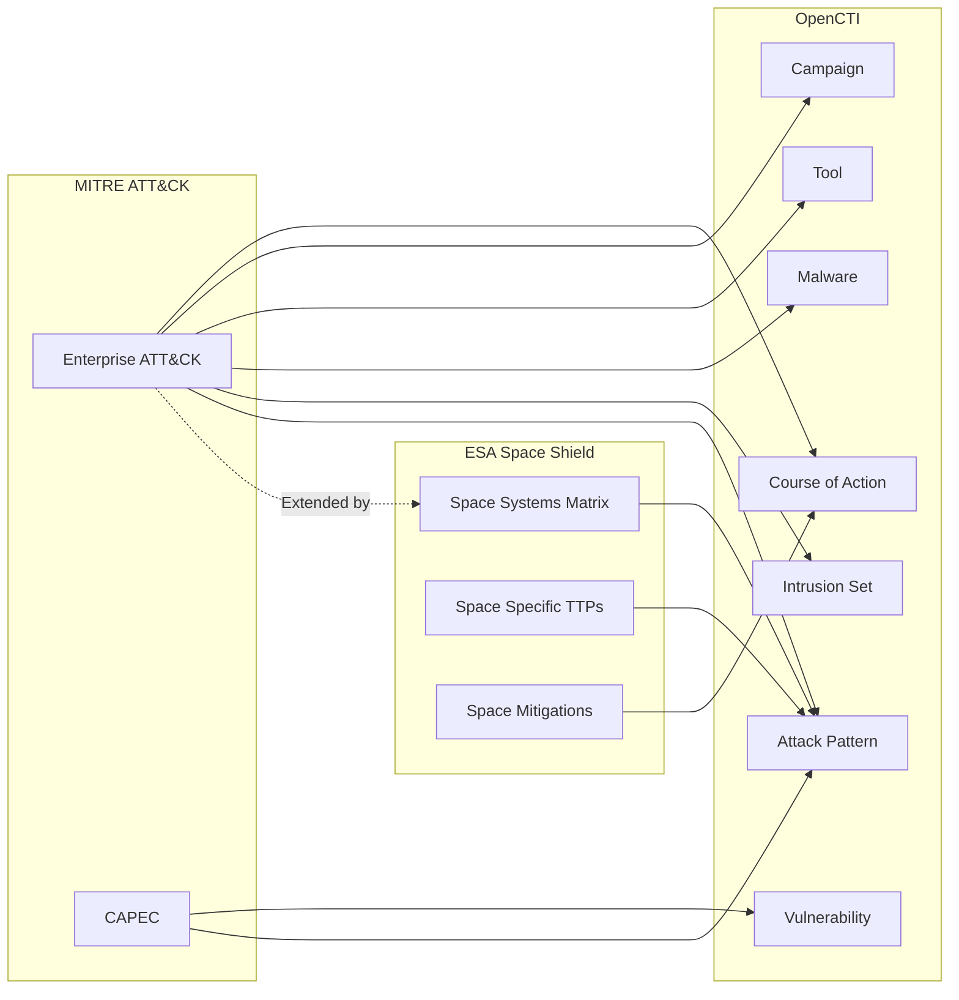

# OpenCTI Automotive Threat Matrix (ATM) by Automotive Information Sharing and Analysis Center (ISAC) Connector

| Status | Date | Comment |
|--------|------|---------|
| -  | -    | -       |

This connector named ATM CONNECTOR imports the complete ATM framework by the Automotive Information Sharing and Analysis Center (ISAC) into OpenCTI.

## Table of Contents

- [OpenCTI ATM Connector](#opencti_connector_atm)
  - [Table of Contents](#table-of-contents)
  - [Introduction](#introduction)
  - [Installation](#installation)
    - [Requirements](#requirements)
  - [Configuration variables](#configuration-variables)
    - [OpenCTI environment variables](#opencti-environment-variables)
    - [Base connector environment variables](#base-connector-environment-variables)
    - [Connector extra parameters environment variables](#connector-extra-parameters-environment-variables)
  - [Deployment](#deployment)
    - [Docker Deployment](#docker-deployment)
    - [Manual Deployment](#manual-deployment)
  - [Usage](#usage)
  - [Behavior](#behavior)
  - [Debugging](#debugging)
  - [Additional information](#additional-information)

## Introduction

The Automotive Threat Matrix ([ATM](https://atm.automotiveisac.com/)) enumerates automotive adversary tactics and supporting techniques based on real-world observations such as validated automotive attacks and peer-reviewed and reproducible automotive exploit research.

The [ATM](https://atm.automotiveisac.com/) provides a common threat taxonomy intended to accelerate all aspects of automotive cybersecurity governance, including:

- Threat and risk assessment modeling
- Intelligence sharing
- Attack trend analysis
- Incident response
- Compliance reporting
- Cybersecurity testing
- Vulnerability management

This connector imports the complete ATM framework.

All data is imported in native STIX 2.1 format from ATM's official site.

## Installation

### Requirements

- OpenCTI Platform >= 6.x
- Internet access to GitHub raw content

## Configuration variables

There are a number of configuration options, which are set either in `docker-compose.yml` (for Docker) or in `config.yml` (for manual deployment).

### OpenCTI environment variables

| Parameter     | config.yml | Docker environment variable | Mandatory | Description                                          |
|---------------|------------|-----------------------------|-----------|------------------------------------------------------|
| OpenCTI URL   | url        | `OPENCTI_URL`               | Yes       | The URL of the OpenCTI platform.                     |
| OpenCTI Token | token      | `OPENCTI_TOKEN`             | Yes       | The default admin token set in the OpenCTI platform. |

### Base connector environment variables

| Parameter         | config.yml      | Docker environment variable   | Default         | Mandatory | Description                                                                 |
|-------------------|-----------------|-------------------------------|-----------------|-----------|-----------------------------------------------------------------------------|
| Connector ID      | id              | `CONNECTOR_ID`                |                 | Yes       | A unique `UUIDv4` identifier for this connector instance.                   |
| Connector Type      | type              | `CONNECTOR_TYPE`                |  "EXTERNAL_IMPORT"               | Yes       | The type of the connector (in this case "EXTERNAL_IMPORT")                   |
| Connector Name    | name            | `CONNECTOR_NAME`              | ATM Automotive ISAC    | Yes        | Name of the connector.                                                      |
| Connector Scope   | scope           | `CONNECTOR_SCOPE`             | "attack-pattern", "x-mitre-tactic", "x-mitre-matrix", "campaign", "relationship"           | Yes        | The scope or type of data the connector is importing.                       |
| Log Level         | log_level       | `CONNECTOR_LOG_LEVEL`         | info           | Yes        | Determines the verbosity of the logs: `debug`, `info`, `warn`, or `error`.  |

### Connector extra parameters environment variables

| Parameter                | config.yml                   | Docker environment variable      | Default                                                                              | Mandatory | Description                                                    |
|--------------------------|------------------------------|----------------------------------|--------------------------------------------------------------------------------------|-----------|----------------------------------------------------------------|
| ATM Stix Url | atm.stix_url | `ATM_STIX_URL` | "/app/data/latest_atm.json"                                                                              | Yes        | The local path for the Knowledge Base.            |
| ATM Confidence Level | spaceshield.confidence_level | `ATM_CONFIDENCE_LEVEL` | 75                                                                              | Yes        | The confidence level for the information ingested.            |
| ATM Author Name | atm.author_name | `ATM_AUTHOR_NAME` | AUTO-ISAC (Automotive Information Sharing and Analysis Center)                                                                              | Yes        | The author's name for each entity ingested.            |
| ATM Author Identity Class | atm.author_identity_class | `ATM_AUTHOR_IDENTITY_CLASS` | "organization"                                                                              | Yes        | The author's identity class the author.      
| ATM Mitre Kill Chain Name | atm.mitre_kill_chain_name | `ATM_MITRE_KILL_CHAIN_NAME` | "mitre-attack"                                                                              | Yes        | The prefix for the proprietary attack pattern of “Mitre Attack”.    |
| ATM ATM Kill Chain Name | atm.atm_kill_chain_name | `ATM_ATM_KILL_CHAIN_NAME` | "atm-automotive"                                                                              | Yes        | The prefix for the proprietary attack pattern of ISAC.    |

## Deployment

### Docker Deployment

Build the Docker image:

```bash
docker build -t opencti/connector-atm:latest .
```

Configure the connector in `docker-compose.yml`:

```yaml
  connector-atm:
    image: ghcr.io/serlabuniba/opencti_connector_atm:latest
    build:
      context: ./connector-atm
    environment:
      - OPENCTI_URL=http:localhost
      - OPENCTI_TOKEN=ChangeMe   #Token of the user
      - CONNECTOR_ID=ChangeMe
      - CONNECTOR_TYPE=EXTERNAL_IMPORT
      - CONNECTOR_NAME=ATM Automotive ISAC
      - CONNECTOR_SCOPE=attack-pattern,x-mitre-tactic,x-mitre-matrix,campaign,relationship
      - CONNECTOR_LOG_LEVEL=info
      - CONNECTOR_DURATION_PERIOD=P7D
      - CONNECTOR_RESET_STATE_ON_START=false
      - ATM_STIX_URL=/app/data/latest_atm.json
      - ATM_CONFIDENCE_LEVEL=75
      - ATM_MITRE_KILL_CHAIN_NAME=mitre-attack
      - ATM_ATM_KILL_CHAIN_NAME=atm-automotive
      - ATM_AUTHOR_NAME=AUTO-ISAC (Automotive Information Sharing and Analysis Center)
      - ATM_AUTHOR_IDENTITY_CLASS=organization
    depends_on:
      opencti:
        condition: service_healthy
    restart: always
```

Start the connector:

```bash
docker compose up -d
```

### Manual Deployment

1. Create `config.yml` based on `config.yml.sample`.

2. Install dependencies:

```bash
pip3 install -r requirements.txt
```

3. Start the connector from the `src` directory:

```bash
python3 -m __main__
```

## Usage

The connector runs automatically at the interval defined by `CONNECTOR_DURATION_PERIOD` (7 days).

To force an immediate run:

**Data Management → Ingestion → Connectors**

Find the connector and click the refresh button to reset the state and trigger a new sync.

## Behavior

The connector fetches STIX 2.1 bundles from the [ATM]([https://spaceshield.esa.int/](https://atm.automotiveisac.com/)) official site by ISAC and imports them directly into OpenCTI. During the processing of the entire bundle, the connector: 
- inserts the author's identity as the first object, 
- sets the “created_by_ref” field on all applicable objects (based on the SKIP_AUTHOR_TYPES set compose by {"bundle", "relationship", "x-mitre-matrix"}),
- sets the kill_chain_phases on attack-pattern objects (based on the ATM_PHASE_TO_KILLCHAIN set).
The ATM_PHASE_TO_KILLCHAIN dictionary is composed by the following tuples:
- "reconnaissance":           "mitre-attack",
- "resource_development":     "mitre-attack",
- "initial_access":           "mitre-attack",
- "execution":                "mitre-attack",
- "persistence":              "mitre-attack",
- "privilege_escalation":     "mitre-attack",
- "defense_evasion":          "mitre-attack",
- "credential_access":        "mitre-attack",
- "discovery":                "mitre-attack",
- "lateral_movement":         "mitre-attack",
- "collection":               "mitre-attack",
- "command_and_control":      "mitre-attack",
- "exfiltration":             "mitre-attack",
- "impact":                   "mitre-attack",
- "manipulate_environment":   "atm-automotive",
- "affect_vehicle_function":  "atm-automotive",
- "vehicle_network_access":   "atm-automotive",
- "ecu_compromise":           "atm-automotive",
- "sensor_manipulation":      "atm-automotive",
- "firmware_manipulation":    "atm-automotive",
- "can_bus_attack":           "atm-automotive",
- "ota_attack":               "atm-automotive",


### Data Flow



### Entity Mapping

| MITRE Data Type      | OpenCTI Entity      | Spaceshield Specific Content & Description       |
|----------------------|---------------------|--------------------------------------------------|
| attack-pattern       | Attack Pattern      | Tactics and techniques. It includes specific space-domain techniques such as “telemetry spoofing” and “link jamming.”                           |
| intrusion-set        | Intrusion Set       | Threat actor groups                              |
| malware              | Malware             | Malware families and samples                     |
| tool                 | Tool                | Legitimate tools used by adversaries             |
| campaign             | Campaign            | Attack campaigns                                 |
| course-of-action     | Course of Action    | Mitigations and defensive measures. It include specific mitigations for the Ground and Space segments (e.g., on-board encryption).               |
| x-mitre-tactic       | Kill Chain Phases                   | Converted to kill chain phases. It defines specific space-domain phases of the “Space Shield Kill Chain” (e.g., Space Segment Access).                   |
| x-mitre-matrix       | Kill Chain                   | ATT&CK matrix metadata. It generates the dedicated “Space Systems Matrix” view.                           |
| x-mitre-data-source  | Data Source                   | Data sources for detection. It includes specific space-domain log sources (e.g., satellite telemetry, ground station logs).                       |
| x-mitre-data-component  | Data Component                   | Data components for detection. It incldes data subsets (e.g., CCSDS packets, system bus logs).                      |
| external-reference  | External Reference                   | Direct links to the official Mitre Attack and ESA Space Shield documentation for each technique.                      |
		
### ATT&CK Matrices Imported

1. **Enterprise ATT&CK**: Windows, macOS, Linux, Cloud, Network, Containers
2. **CAPEC**: Attack patterns with CWE/CVE relationships
3. **Space Shield Kill Chain**: Space-domain specific kill chain phases

### Processing Details

- **Native STIX Import**: All data is in native STIX 2.1 format
- **Relationships**: All MITRE relationships (uses, mitigates, subtechnique-of) are preserved. Specific relatioships for the “space” domain are added.
- **Kill Chain**: ATT&CK tactics are mapped to kill chain phases. Specific kill chain phases for the “space” domain are added.
- **External References**: MITRE IDs and documentation links are preserved. Specific external references are added for the "space" domain (by ESA).

## Debugging

Enable verbose logging:

```env
CONNECTOR_LOG_LEVEL=debug
```

## Additional information

- **Large Dataset**: Initial import may take several minutes due to the size
- **Reference**: [MITRE ATT&CK](https://attack.mitre.org/) | [CAPEC](https://capec.mitre.org/) | [SPACE-SHIELD](https://spaceshield.esa.int/)
